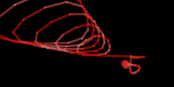
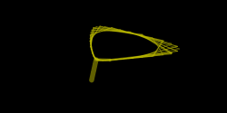

# folmura ([DEMO](https://abagames.github.io/folmura/index.html))

Randomly generated visual with randomly generated formula.

Click/Tap to generate another one. Press the 'F' key to see the formulas.

[](https://abagames.github.io/folmura/index.html)

## Interesting random seeds

[](https://abagames.github.io/folmura/index.html?s=62065297)
[](https://abagames.github.io/folmura/index.html?s=27197560)
[](https://abagames.github.io/folmura/index.html?s=827394148)
[](https://abagames.github.io/folmura/index.html?s=59931162)
[](https://abagames.github.io/folmura/index.html?s=82205833)
[](https://abagames.github.io/folmura/index.html?s=161440481)
[](https://abagames.github.io/folmura/index.html?s=92028492)
[](https://abagames.github.io/folmura/index.html?s=388848054)
[](https://abagames.github.io/folmura/index.html?s=521822124)
[](https://abagames.github.io/folmura/index.html?s=718006707)
[](https://abagames.github.io/folmura/index.html?s=509235666)
[](https://abagames.github.io/folmura/index.html?s=950816576)
[](https://abagames.github.io/folmura/index.html?s=71464548)
[](https://abagames.github.io/folmura/index.html?s=303599227)
[](https://abagames.github.io/folmura/index.html?s=774417313)
[](https://abagames.github.io/folmura/index.html?s=635382188)
[](https://abagames.github.io/folmura/index.html?s=506507566)
[](https://abagames.github.io/folmura/index.html?s=375615874)
[](https://abagames.github.io/folmura/index.html?s=359947371)
[](https://abagames.github.io/folmura/index.html?s=596174466)
[](https://abagames.github.io/folmura/index.html?s=929464066)
[](https://abagames.github.io/folmura/index.html?s=38676985)
[](https://abagames.github.io/folmura/index.html?s=567782962)

## How to generate a visual

The canvas consists of points connected with lines. The position, size and color of each point are defined by variables:

```
x/y = horizontal/vertical position
w/h = width/height ((width + height) / 2 is used as a stroke weight of each line)
H/S/B = color (Hue/Saturation/Brightness)
```

Each variable is calculated by a randomly generated formula. The formula is generated with combination of functions:

```
v1 + v2, v1 - v2, v1 * v2, v1 / v2, 
sin(v1), cos(v1), exp(v1), pow(v1, v2), noise(v1), 
v1 > v2 ? v3 : v4
```

The functions described above or variables described below are placed recursively to v1-v4.

```
t = time (in seconds)
i = index of the point (each point has an index starting from 0)
a/b = random integer value (2 to 10)
```
